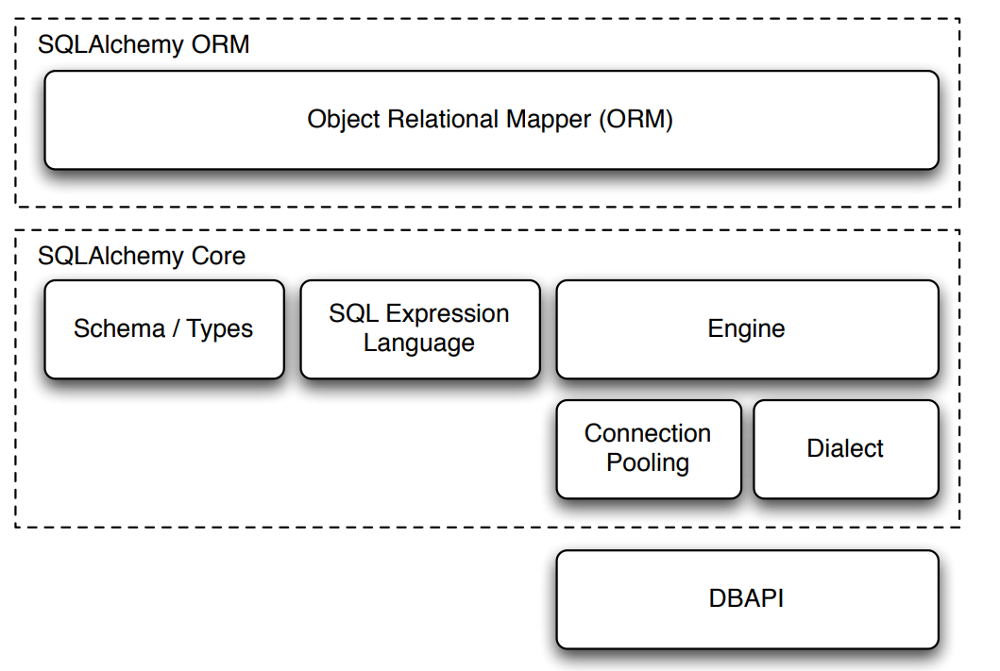

# Session in SQLAlchemy ORM

## Contents
* What is a session?
    
    way to communicate in ORM

    basic parts of ORM are mapping language classes with database models

    how it fits - engine, connection, transaction then session
    (show figure also - give credit)

    simple example to show how it is created, used

* How it works?
    
    take previous example and show behind the scenes

* All basic operations using session

    CRUD

* properties of session

    commit, explunge, rollback, refresh, object deattach
    merge

* thread safe session

    session are not thread safe
    create thread scopped session, show example(flask)

* other things

    * state management(session as a state holder)

    * transaction (using session)

    * also read(ORM querying guide)

    cascading (operation with `relationship()`)

    persistance techniques(practical useful things with session)


---
## What is a session?

Session is an object which is used in performing database operations when we are using ORM for the database.

Many database connection tools like SQLAlchemy provide two ways to interact with the database - Query Builder and the ORM. 

I will be using SQLAlchemy for the example, but similar concept is used by any other database toolkit providing these functionality.

1.  **Query Builder**: It provides similar API like the SQL, to interact with the database. The basic components are - `Engine`, `Connection`, `MetaData`, `Table`, `Transaction`, `Column` and more. 

    The basic idea of using it is like - use the `Engine` to connect with the database, it acts like the connection manager. Then create `Connection` using the engine. When you have the connection, you can begin a `Transaction`, execute it and finally commit/rollback it. Withing a transaction, you can create `Table` which have `Column` of certain types like `Integer`, `String` or execute queries like `Select`.
        
    SQLAlchemy has the [**core**](https://docs.sqlalchemy.org/en/20/core/) module which provides this API.

2. **ORM**: Object Relational Mapping(ORM) follows the object-oriented programming approach. We create classes for the database entities like the table. The properties of that class represent the column in that table. Finally, the methods of the class are used to define the database constraints and defaults. 

    For example, below example defines a *user* table in the database with two columns *id* and *name* where *id* is the primary key.

    ```python
    class User(Base):
        __tablename__ = 'users'
        
        id = Column(Integer, primary_key=True, autoincrement=True)
        fullname = Column(String, nullable=False)

    with Session(engine) as session:
        john = User(fullname="John Doe")
        print(john.fullname)    # accessing the object - John Doe

        session.add(john)   # insert row in the user table
        session.commit()    # persist the object  


    ```

    In this way we interact with the objects which is then converted by the ORM to equivalent SQL code that is executed by the database. This not only reduces the complexity and redundancy but also gives us ability to interact with database in terms of objects.


    Notice in the above code that we used **session** to insert record in the database. 

### What is happening behind the scene?

Look at be complete-code below to understand how things are working:

```python

```
Let's quickly breakdown each line:

* `session.begin()` : This initiates a transaction in the database. Behind the scene, the session request the engine to get a database connection. Further requests to database in this session will be made through this connection.

* `session.add(john)` : Here, the *john* object to is converted to equivalent SQL row and a insert SQL query is generated that is held by the session object.

* `session.flush()` : Now, the user *john* is **temporarily** inserted into the database. The `flush()` command temporarily writes to the database. This change is not permanant and can be rolledback by calling `session.rollback()`. Note that we have disabled `autoflush`, however, when it is enabled then flush will be automatically called after `session.add()`

* `session.commit()` : This command makes the changes permanant into the database. Also, the *john* object will be expired, which means that next call to the object will fetch the object from the database instead of getting it from the identity map.

* `session.close()` : This command finally closes the transaction and the connection is returned back to the connection pool.

### Where does the session fit?

Below image describes the architecture of SQLAlchemy. 

    
|  | 
|:--:| 
| *SQLAlchemy Architecture. Credit: [SQLAlchemy: an Architectural Retrospective](https://techspot.zzzeek.org/files/2011/sqla_arch_retro.key.pdf)* |

As we can see, ORM provides an abstraction over the Core module. The session helps in getting the connection from the connection pool. It allows storing the ORM object, creating a transaction, mapping the ORM object to equivalent SQL query and finally executing.

### How does the session store object?

Inside the session, there is a data structure called [identity map](https://docs.sqlalchemy.org/en/20/glossary.html#term-identity-map), which stores the objects that are fetched or created within the session. It is similar to a map where the key is the primary key value of the object and value is the object itself. So, whenever a query is made, the primary key of fetched row is checked if it is present within the identity map, if it does then the existing object is returned.

An example from the [docs](https://docs.sqlalchemy.org/en/20/orm/session_basics.html#expiring-refreshing):

```python
u1 = session.scalars(select(User).where(User.id == 5)).one()
u2 = session.scalars(select(User).where(User.id == 5)).one()
u1 is u2    # True
```

In above example, *u1* and *u2* are the same object fetched from Identity Map.

## CRUD operations using session

1. **Create**
First we create a class object and then we insert it into the database using the `session.add(obj)` command.

```python
with Session(engine) as session:
    john = User(fullname="John Doe")
    session.add(john)
    session.commit()
```
2. **Read**
Reading the object is done by passing the sql statement created from `Select` object to the `session.execute(stmt)` or `session.scalars(stmt)` functions.

`session.execute()` return list of row object, while `session.scalars()` extracts the first value from each row and returns the list of that. This is same as `session.execute().scalars()`.See the below example-

```python
from sqlalchemy import select

with Session(engine) as session:
    stmt1 = select(User).where(User.fullname == "John Doe").all()
    
    # Output => list[Row objects]
    # Row object => (User(...), )
    # Each row object is a tuple with one User object as we provided User in the select function
    # Finally => [(User(id=1, fullname="John Doe"), )]
    session.execute(stmt1)
    
    # Output => list[ScalarResult object]
    # ScalarResult object => Row[0] i.e first value of each row object
    # Finally => [User(id=1, fullname="John Doe")]
    session.scalars(stmt1)

    stmt2 = select(user.id, user.fullname).where(User.fullname == "John Doe").all()

    # Output => list[Row objects]
    # Row object => (user.id, user.fullname)
    # Finally => [(1, "John Doe")]
    session.execute(stmt2)

    # Output => list[ScalarResult object]
    # ScalarResult object => Row[0] i.e first value of each row object
    # Finally => [1]
    session.scalars(stmt2)

3. **Update**

4. **Delete**
